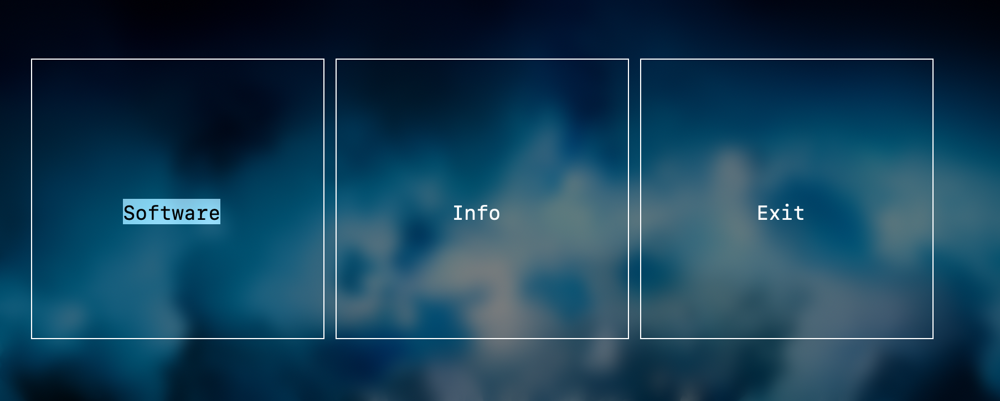

# bino
Terminal app that stores and runs small scripts. <br>
It currently stores my old scripts so it doesn't have much functionality. <br>
I will add more usefull stuff over time. <br>

Installation
------------

First you need to install python3 to run the scripts in the app. <br>
After that run these commands on your terminal :

``` bash
$ git clone https://github.com/derinozon/bino.git
$ cd bino
$ make
$ make install
```

Usage
--------

After installing you can call `bino` in your terminal to apen the app. <br>
You can access the manual [here](res/info.md) as well as in the app.

Screenshots
--------


